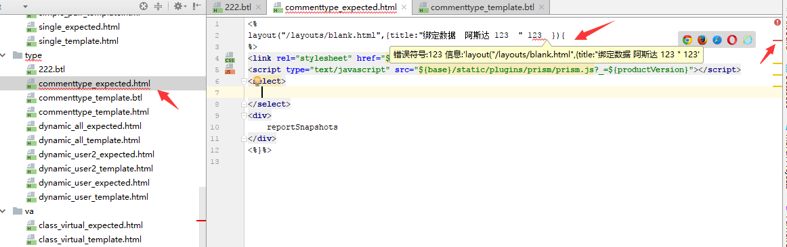

### beetl-idea-plugin
- 针对模版文件进行验证是否正确
- 错误定位（定位不精确，主要是模版文件会被antlr解析为source）
#### 需要使用【巴科斯范式】实现自定义语言才能完整的实现beetl模版引擎的idea插件（我不会巴克斯范式啊）
### 添加自定义配置
 - File >> Settings >> Beetl-plugin
 - File >> Settings >> Other Settings >> Beetl-plugin

# 安装后效果

